<div align="center">

# The Idea Evaluator ✓

**Write down a project idea and get it marked like an exam answer.**

A mark out of ten with the reasons, the real risks, what people are already saying about the problem, a plan sized to the weeks you have, and the documents to start building: an IEEE 830 SRS with wireframes, a data model and a user story map. It runs on the website, or inside your own AI as an MCP connector. Built for students and hackathon teams.


[](https://github.com/IAbdullahSlash/idea-evaluator/actions/workflows/pages.yml)

**[Try it on the web ↗](https://idea-evaluator-slash.vercel.app)** · **[Showcase: video and interactive diagrams ↗](https://iabdullahslash.github.io/idea-evaluator/)** · Connector address: `https://idea-evaluator-slash.vercel.app/api/mcp`

</div>

## Walkthrough video

<!-- mcp-connector-walkthrough-video -->

https://github.com/user-attachments/assets/9f3f95a9-3afa-44b7-9d22-c82dcbc27014

<sub><b>57 s · 1080p · with sound.</b> Video not playing? <a href="https://iabdullahslash.github.io/idea-evaluator/#video">Watch it on the showcase page</a> or <a href="showcase/media/mcp-connector-walkthrough.mp4">download mcp-connector-walkthrough.mp4</a>.</sub>

---

## Table of contents

▶️ [Walkthrough video](#walkthrough-video)

1. [The problem](#1-the-problem)
2. [What it does](#2-what-it-does)
3. [Step by step: the connector in your own AI](#3-step-by-step-the-connector-in-your-own-ai)
   - [3.1 Connect it](#31-connect-it)
   - [3.2 Stage by stage](#32-stage-by-stage)
   - [3.3 The SRS and the other Hand-off documents](#33-the-srs-and-the-other-hand-off-documents)
4. [How it works](#5-how-it-works)
   - [5.1 System architecture](#51-system-architecture)
   - [5.2 The four-stage workflow](#52-the-four-stage-workflow)
   - [5.3 One evaluation through the connector](#53-one-evaluation-through-the-connector)
   - [5.4 How the SRS is written](#54-how-the-srs-is-written)
5. [MCP tools reference](#6-mcp-tools-reference)
6. [Project structure](#9-project-structure)
7. [Tech stack](#12-tech-stack)


---

## 1. The problem

Ask a general-purpose AI about a project idea and it is on your side from the first message. It says the idea is great, suggests a dozen features, and moves on. It doesn't:

| It doesn't… | So you never find out… |
|---|---|
| **Understand** the idea | what it is for, who it is for, or how much time you really have |
| **Brainstorm** it honestly | which parts are strong, which are weak, and whether to build it at all |
| **Research** it | who is already doing it and what people are actually saying about the problem |
| **Guide** you to a build | what to cut so it fits your weeks, or what the requirements are |

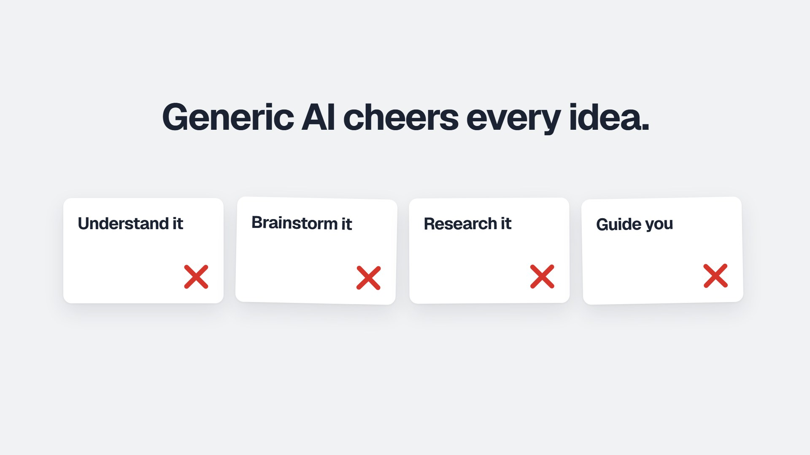

The Idea Evaluator marks the idea instead. It asks what's missing first, scores it against six explained criteria, researches it in live sources, plans it to your time, and writes the documents you need to start. You can use it on the website, or add it to the AI you already use.

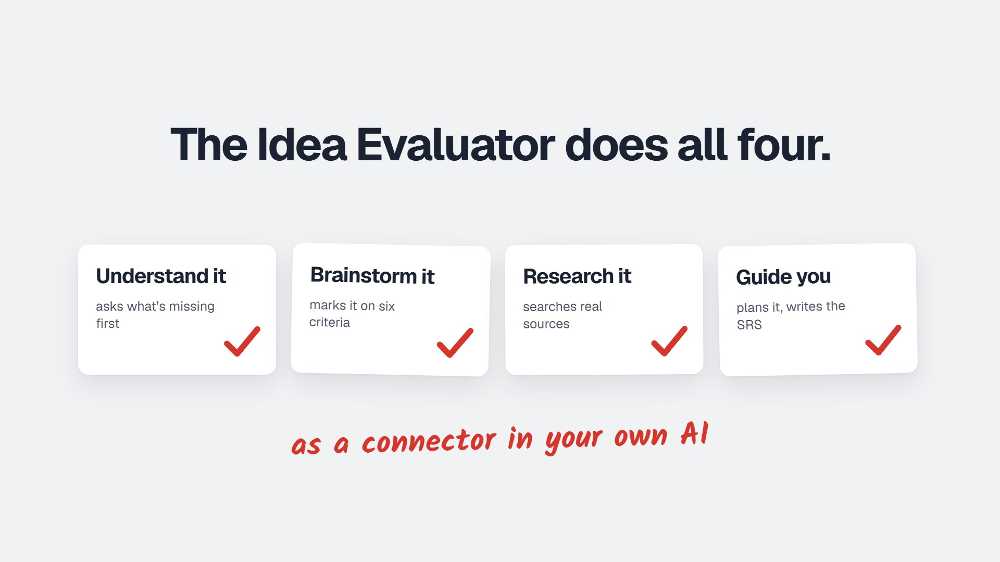

---

## 2. What it does

The evaluation runs in four stages. Each opens only when you choose to continue, so a weak idea can stop at the first.

| Stage | What you get |
|---|---|
| **1 · Snapshot** | A mark out of 10, the average of six criteria (a real problem, worth solving, not already done, something new, within reach, someone wants it), each with its own mark and reason. A recommendation (Build / Narrow it down / Rethink / Drop), odds of success, a reality check, who it is for, and questions to ask yourself. If the idea is too vague to mark, up to three follow-up questions come first |
| **2 · Summary** | Pros and cons, risks with severity, what people are discussing (Hacker News, Stack Exchange), recent news (Google News), quick wins, existing solutions with every link checked, similar projects on GitHub, and an executive summary |
| **3 · Plan** | Whether the scope fits your time, phases sized to it, scope cuts, the team, the stack, versions, security, and costs added up |
| **4 · Hand-off** | **Idea as an overall** (four questions: the problem and who cares, building and scaling it, maintaining it, measuring success) and a detailed **SRS** (IEEE 830 outline with the product vision, user story map, wireframes, data model and traceability), both as PDF or Word; the plan sent to **Linear** as a roadmap; and searches for people with the plan's skills |

**Highlights**

- ✍️ **Marked, not cheered.** The mark is the average of six explained criteria, so every score can be traced to its reasons.
- 🔎 **Real research.** Discussions, news and repositories come from live searches, not the model's memory. Existing-solution links are opened and dropped if they don't work.
- 🧮 **Arithmetic in code.** Phase weeks, costs and the overall mark are added up by the server, not guessed by the model.
- 📄 **Documents you can hand in.** An IEEE 830 / ISO/IEC/IEEE 29148 SRS where every requirement cites a user story and a screen.
- 🤖 **In your own AI.** The same method runs as an MCP connector in Claude, ChatGPT or Gemini. Your AI does the thinking; the server runs no AI at all.
- 🔗 **One link.** Every stage made through the connector is saved for 90 days and opens read-only at `/e/<id>`.

---

## 3. Step by step: the connector in your own AI

The Idea Evaluator is also an MCP server. Add one address to your AI as a custom connector and it evaluates ideas with the same method as the website, in your chat. These screenshots come from the [walkthrough video](#walkthrough-video).

### 3.1 Connect it

**Step 1. Copy the connector address.** The landing page's *Or use it in your own AI* section has the address and a Copy button.

```
https://idea-evaluator-slash.vercel.app/api/mcp
```

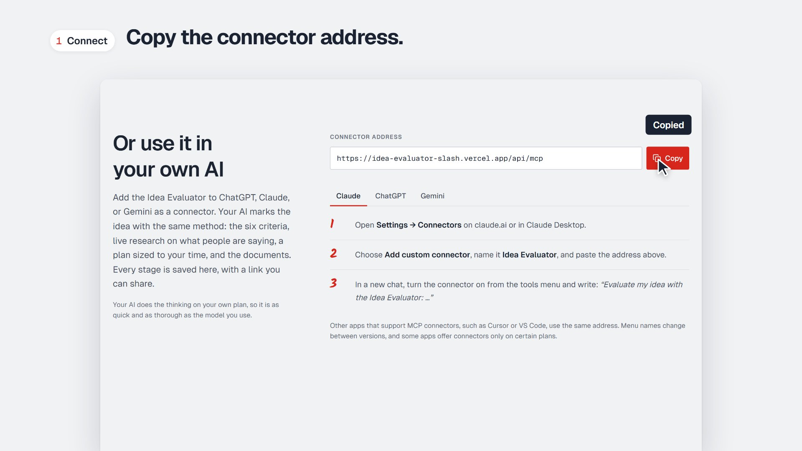

**Step 2. Follow the steps for your app.** The same section has tabs for Claude, ChatGPT and Gemini, each with its own steps:

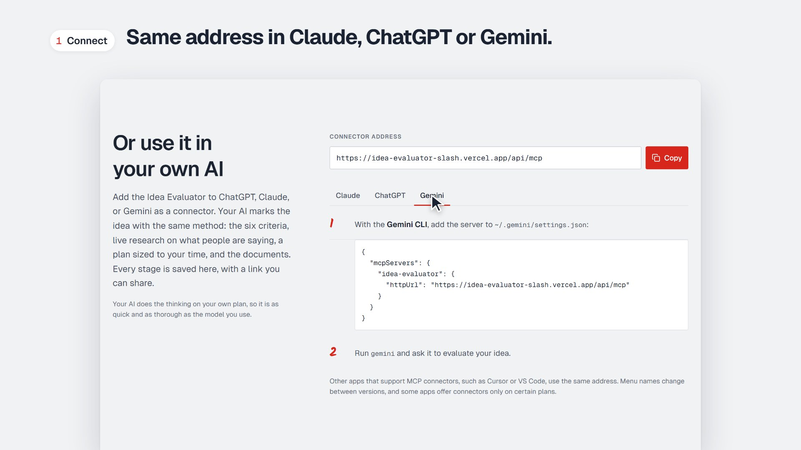

| App | Steps |
|---|---|
| **Claude** | click **+** from the chat on claude.ai or in Claude Desktop. Choose **Connectors → Add connector → Add custom connector**, name it **Idea Evaluator**, and paste the address. In a new chat, turn the connector on from the tools menu and write *"Evaluate my idea with the Idea Evaluator: …"* |
| **ChatGPT** | Open **Plugins → Add → Add custom MCP server**. Create a connector named **Idea Evaluator**, paste the address, and choose **No authentication**. In a new chat, type **@** and select from the menu and ask it to evaluate your idea |
| **Gemini** | With the **Gemini CLI**, add the server to `~/.gemini/settings.json` (below), run `gemini`, and ask it to evaluate your idea |
| **Others** | Apps that support MCP connectors, such as Cursor or VS Code, use the same address |

```json
{
  "mcpServers": {
    "idea-evaluator": {
      "httpUrl": "https://idea-evaluator-slash.vercel.app/api/mcp"
    }
  }
}
```

Menu names change between versions, and some apps offer connectors only on certain plans.

**Step 3. Add it as a custom connector.** Name it, paste the address, and add it. It shows as connected.

| Adding it | Connected |
|---|---|
| 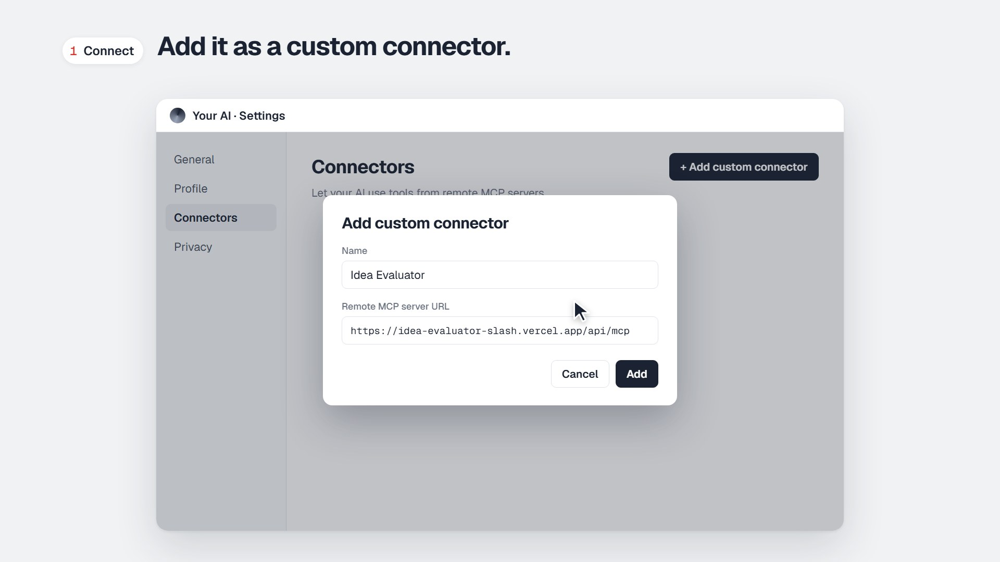 | 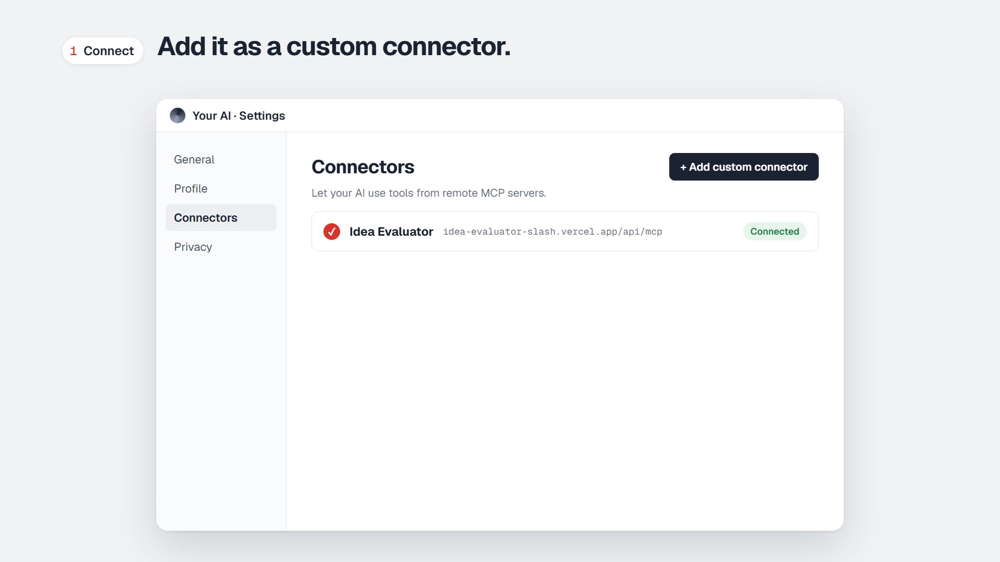 |

**Step 4. Turn it on in a new chat** and ask for an evaluation.

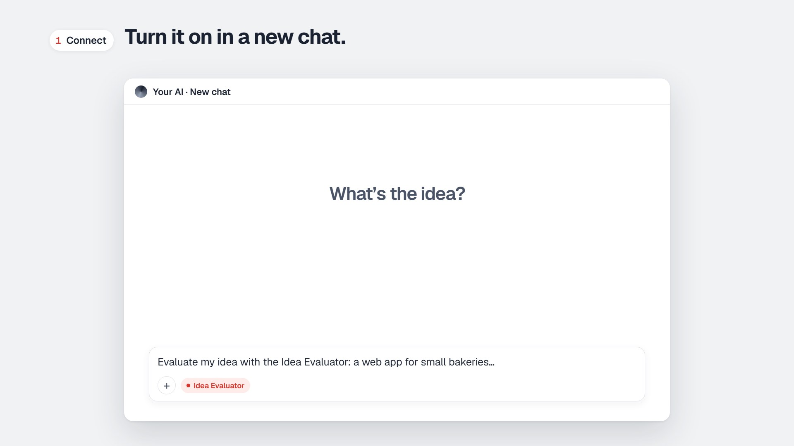

### 3.2 Stage by stage

From here your AI calls the server's tools in order. Each reply carries the next stage's method and how to write it up in the chat. On the right of each screenshot is the saved stage at the evaluation's link.

**Understand.** Before anything is marked, your AI asks for what's missing: what it is for, how much time you have, your experience. Then `start_evaluation` checks the idea and the four context answers, starts a stored evaluation, and returns the marking method and the link.

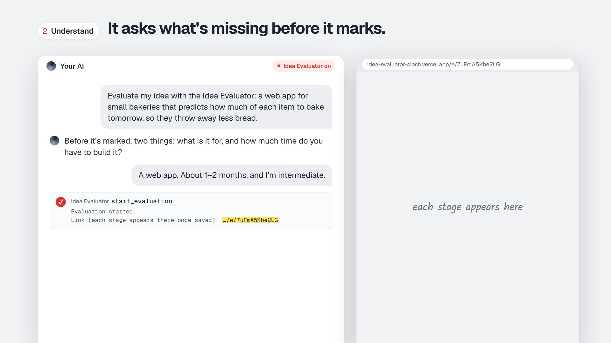

**Snapshot.** Your AI marks the six criteria; `save_snapshot` computes the overall mark from them. Here: **7/10, "Narrow it down", 55% chance of success.**

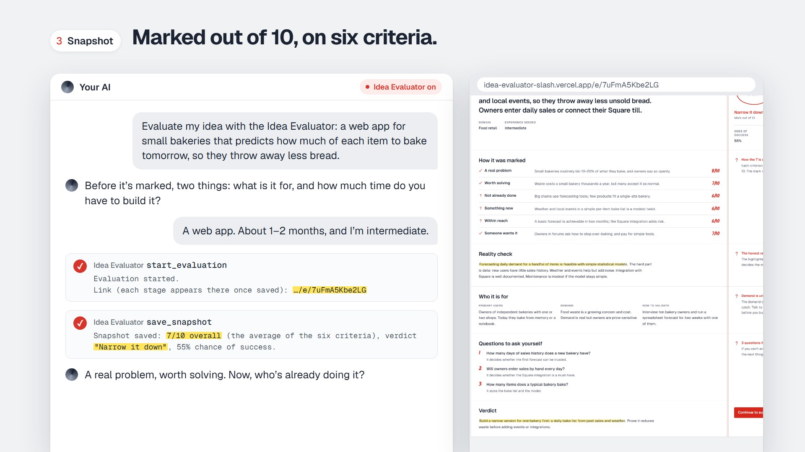

**Research.** `research_market` searches Hacker News, Stack Exchange, Google News and GitHub, and returns the results quoted as data. `save_summary` keeps only discussions and news from that research and opens every existing-solution link: *"1 existing-solution link(s) didn't open and were removed."*

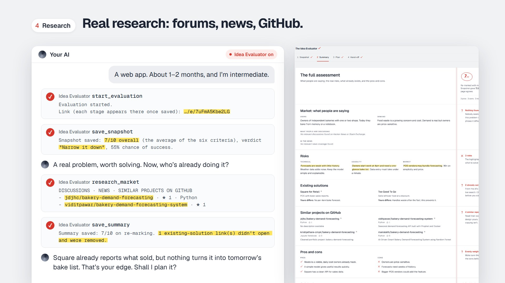

**Plan.** `save_plan` adds up the phases and costs and checks they fit the time available: *"Phases add up to 7 weeks of the 1-2 months available. Running cost at the start: $1/month."*

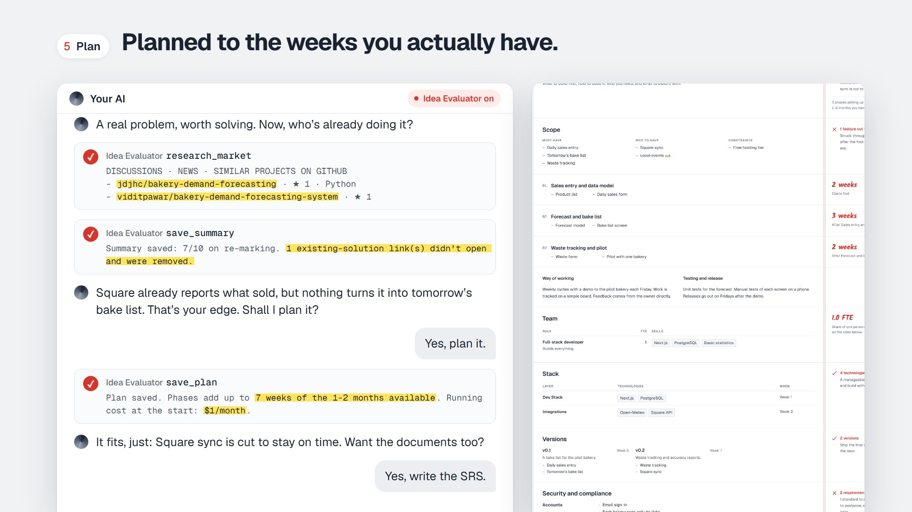

### 3.3 The SRS and the other Hand-off documents

Ask for the documents and your AI writes them part by part, with the server checking each one:

| Tool | What the server checks or computes |
|---|---|
| `save_overall` | The four answers (Yes, Partly or No) and their reasoning: *"1. Yes, 2. Partly, 3. Partly, 4. Yes."* |
| `save_brief` | Numbers the user stories (US-1, US-2, …) into the plan's versions: *"6 stories in 3 activities, 3 in the first release (v0.1)."* |
| `save_wireframes` | Keeps only screens that cite real story IDs: *"4 screens."* |
| `save_srs_overview`, `save_srs_features`, `save_srs_quality` | Assembles the SRS from its three parts, numbers the requirements, and traces them: *"4 features, 8 functional and 7 non-functional requirements, 5 data entities. Traceability: every one of the 6 user stories is covered by at least one requirement."* |

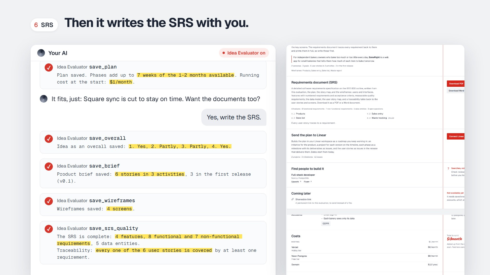

**What's in the SRS.** It follows the IEEE 830 / ISO/IEC/IEEE 29148 outline:

1. **Introduction**: purpose, scope (in and out), definitions, references, overview
2. **Overall description**: product perspective with the vision statement, product functions, user classes, operating environment, constraints, assumptions and dependencies
3. **External interface requirements**: user interfaces (the wireframes, with the stories each screen serves), hardware, software and communications interfaces
4. **System features**: each feature with numbered, testable *"The system shall …"* requirements, priorities and the stories they cite
5. **Non-functional requirements**: performance, safety, security, software quality attributes, business rules
6. **Data requirements**: the data model, drawn as a diagram, with every entity's fields; data retention
7. **Appendices**: the user story map by release, the traceability table (requirement → story → screen), and open questions

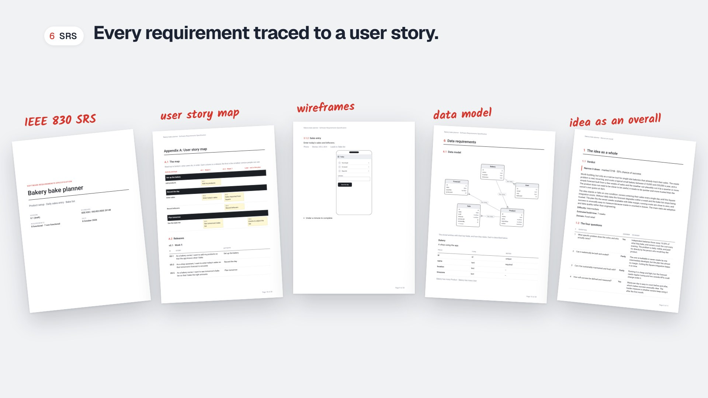

**Take it away.** Every stage is saved to one link. The Hand-off page downloads both documents as **PDF or Word** and can send the plan to **Linear** as a roadmap: a project per version, phases as milestones, deliverables and user stories as issues.

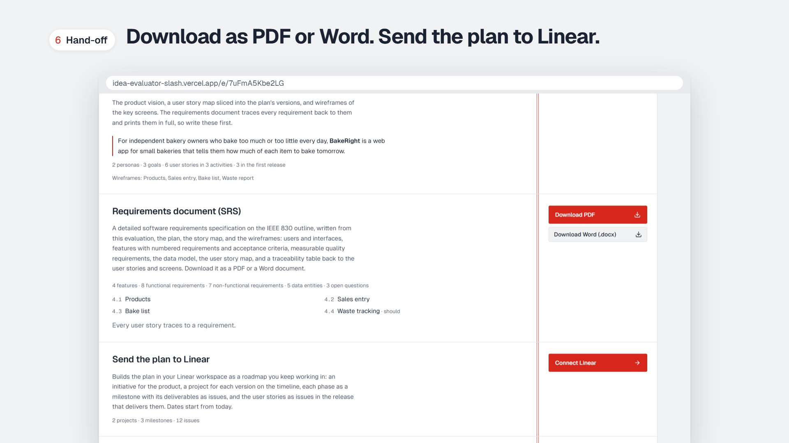

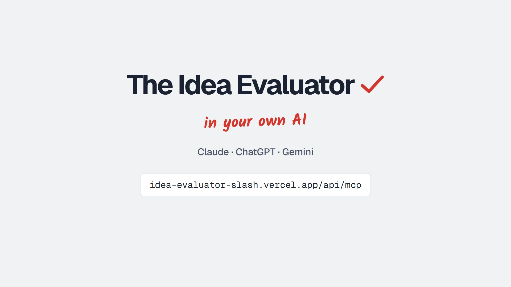

---

## 5. How it works

### 5.1 System architecture

[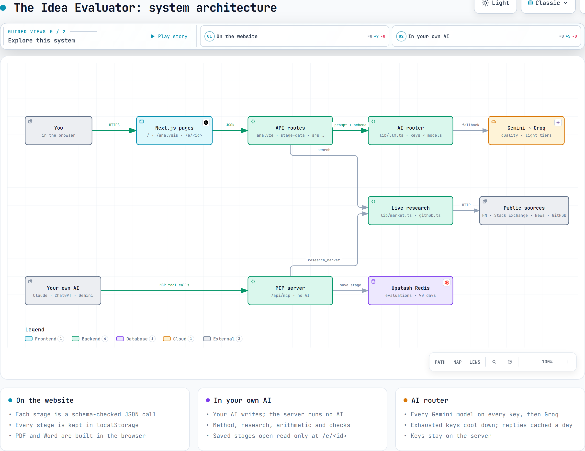](https://iabdullahslash.github.io/idea-evaluator/diagrams/system-architecture.html?present=1)

**[▶ Open the interactive diagram ↗](https://iabdullahslash.github.io/idea-evaluator/diagrams/system-architecture.html?present=1)** · [JSON source](showcase/diagrams/system-architecture.architecture.json)

Two ways in, one method. On the website, the Next.js pages call API routes, which ask the AI router for schema-checked JSON and call the research helpers for live sources. Through the connector, your own AI calls the MCP server at `/api/mcp`, which runs no AI: it supplies the method, the same research helpers, the checks and the arithmetic, and saves each stage to Upstash Redis for 90 days. A saved evaluation opens read-only at `/e/<id>` in the same Snapshot, Summary, Plan and Hand-off pages.

### 5.2 The four-stage workflow

[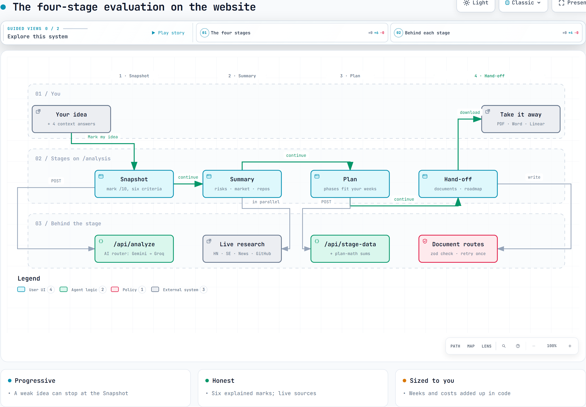](https://iabdullahslash.github.io/idea-evaluator/diagrams/four-stage-evaluation.html?present=1)

**[▶ Open the interactive diagram ↗](https://iabdullahslash.github.io/idea-evaluator/diagrams/four-stage-evaluation.html?present=1)** · [JSON source](showcase/diagrams/four-stage-evaluation.workflow.json)

Each stage is a page on `/analysis` that unlocks only when you continue. Behind each one is a single server call (or three in parallel for the Summary), and every AI reply is checked against a zod schema, with one retry on a different model if it comes back incomplete.

### 5.3 One evaluation through the connector

[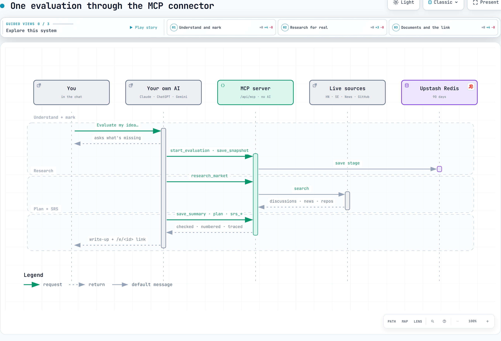](https://iabdullahslash.github.io/idea-evaluator/diagrams/mcp-connector.html?present=1)

**[▶ Open the interactive diagram ↗](https://iabdullahslash.github.io/idea-evaluator/diagrams/mcp-connector.html?present=1)** · [JSON source](showcase/diagrams/mcp-connector.sequence.json)

Your AI asks before it marks, then calls the tools in order. The server saves each stage, computes the mark, searches the live sources and quotes the results back as data (never as instructions), adds up weeks and costs, and numbers and traces the SRS. Your AI writes the result up in the chat with the evaluation's link.

### 5.4 How the SRS is written

[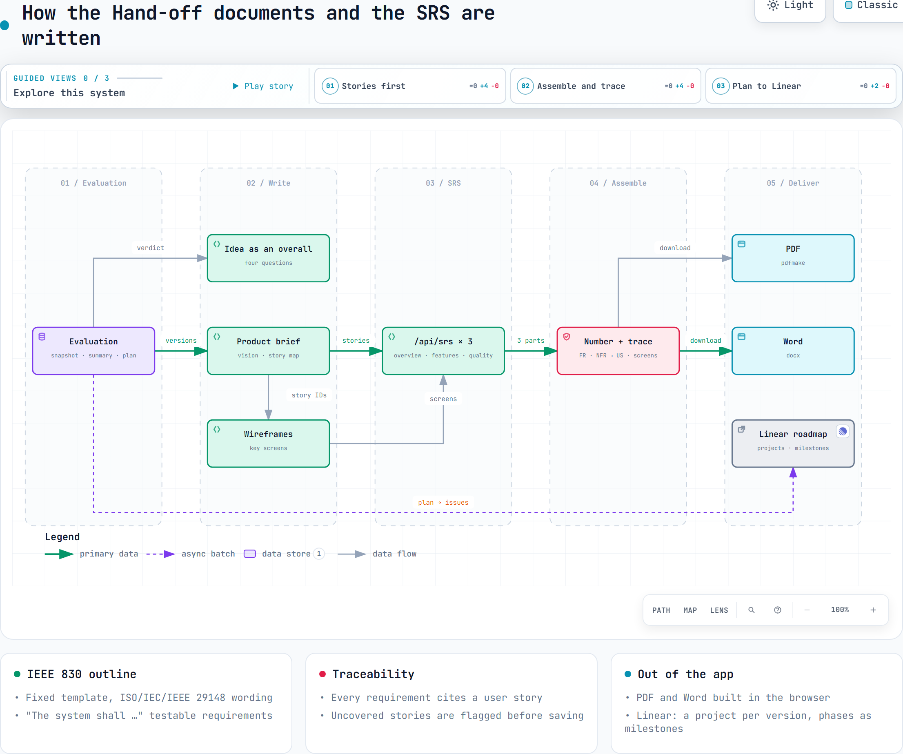](https://iabdullahslash.github.io/idea-evaluator/diagrams/srs-generation.html?present=1)

**[▶ Open the interactive diagram ↗](https://iabdullahslash.github.io/idea-evaluator/diagrams/srs-generation.html?present=1)** · [JSON source](showcase/diagrams/srs-generation.dataflow.json)

Stories come first. The product brief numbers the user stories (US-1…) into the plan's versions; the wireframes cite those IDs. The SRS is then written in three parts at once (overview, features, quality), each in its own request so each gets its own function time; a part that fails is asked for once more, and parts that finished are cached. The page puts them together, numbers the requirements, and traces each one to its stories and screens. Uncovered stories are flagged. The plan goes to Linear separately, as a roadmap.

---

## 6. MCP tools reference

| Tool | What the server does |
|------|----------------------|
| `start_evaluation` | Checks the idea and the four context answers, starts a stored evaluation, returns the marking method |
| `save_snapshot` | Computes the overall mark from the six criteria |
| `research_market` | Searches Hacker News, Stack Exchange, Google News, and GitHub |
| `save_summary` | Keeps only discussions and news from the research, checks solution links |
| `save_plan` | Adds up the weeks and costs, and checks the phases fit the time available |
| `save_overall` | Checks the four answers (Yes, Partly, or No) and their reasoning |
| `save_brief`, `save_wireframes` | Numbers the stories into the plan's versions; keeps only real story ids |
| `save_srs_overview`, `save_srs_features`, `save_srs_quality` | Assembles the SRS, numbers requirements, and checks every story is traced |
| `get_evaluation` | Which stages are saved, and the link |

Every stage is saved for 90 days and viewable, read-only, at `/e/<id>`. Requests are rate-limited per IP.

---

## 9. Project structure

```
app/
├── layout.tsx               # Root layout: fonts and theme
├── page.tsx                 # Landing page
├── login/page.tsx           # Sign-in screen (accounts are not built yet)
├── analysis/page.tsx        # The four-stage evaluation
└── api/
    ├── analyze/             # Snapshot and Summary
    ├── stage-data/          # Plan
    ├── overall/             # Idea as an overall
    ├── brief/               # Product vision and user story map
    ├── wireframes/          # Key screens, described as standard parts
    ├── srs/                 # Requirements document, one of three parts per request
    ├── discussions/         # Discussions and news
    ├── github-repos/        # Similar repositories
    ├── linear/              # Connect to Linear (OAuth), list teams, send the plan as a roadmap
    ├── google-search/       # Web search (needs Google Custom Search keys; not used by the UI yet)
    ├── mcp/                 # MCP server for people's own AI
    ├── evaluations/[id]/    # A saved evaluation, for the read-only view
    └── llm-status/          # Dev-only router status
e/[id]/                      # Short link to a saved evaluation
components/
├── script/                  # The marked-script design system: sheet, margin notes, marks, stage tabs
├── ui/                      # Radix-based primitives (button, input, label, textarea, dropdown menu)
├── ConnectAI.tsx            # "Or use it in your own AI": the connector address and per-app steps
└── *.tsx                    # Other landing page sections
lib/
├── llm.ts                   # Multi-key, multi-model AI router
├── llm-checked.ts           # Ask, check against a schema, retry once on another model
├── mcp/                     # MCP tools, their input contracts, and the method guidance they return
├── evaluation/              # Finishing each stage's data, shared by the website and the MCP tools
├── store.ts                 # Saved evaluations in Upstash Redis
├── rate-limit.ts            # Per-IP limits on the MCP endpoint
├── market.ts, github.ts     # Market research and similar-project search, shared by both
├── schemas/                 # Schemas: snapshot, plan, overall answers, product brief, SRS, and the questions asked with the idea
├── documents/               # Document template (fixed outline), the Idea-as-an-overall and SRS layouts, the wireframe drawing, and the PDF and Word exporters
├── evaluation-context.ts    # What earlier pages learned, as prompt text for the Plan and SRS
├── plan-math.ts             # Phase durations and costs added up
├── handoff.ts               # Hiring searches, downloads
├── linear/                  # Sending the plan to Linear: OAuth, the roadmap's structure, the GraphQL calls
├── hackernews.ts            # Hacker News search and comments
├── stackexchange.ts         # Stack Exchange questions and answers
├── news.ts                  # Google News search
└── validation.ts            # Idea input checks shared by client and server
showcase/                    # Published to GitHub Pages (see section 10)
├── index.html               # The showcase page: video and diagram cards
├── media/                   # Walkthrough video and its poster
├── screenshots/             # Frames from the video, used in this README
└── diagrams/                # Archify sources (.json), interactive pages (.html) and previews (.png)
.github/workflows/pages.yml  # Checks the showcase and deploys it to GitHub Pages
```

---

## 12. Tech stack

| Layer | Technology |
|-------|-----------|
| Framework | Next.js 14 (App Router), React 18 |
| Language | TypeScript |
| Styling | Tailwind CSS 3, Radix UI primitives, Geist and Kalam fonts |
| AI | Google Gemini via `@google/generative-ai`, Groq (OpenAI-compatible API) as fallback |
| Validation | zod |
| Discussions | Hacker News (Algolia search and the official API) and Stack Exchange (Software Recommendations, Web Applications, Academia); no keys needed |
| News | Google News RSS search (no key needed; Google offers it for non-commercial use) |
| Repos | GitHub search API |
| State | localStorage on the website (every stage survives a refresh); Upstash Redis for evaluations made through MCP |
| Documents | `pdfmake` (PDF) and `docx` (Word), built in the browser when downloaded |
| MCP | `mcp-handler` with the MCP SDK v2, rate limits with `@upstash/ratelimit` |
| Hosting | Vercel (app); GitHub Pages via GitHub Actions (showcase) |
| Diagrams | [Archify](showcase/diagrams/) (validated JSON → interactive HTML) |

